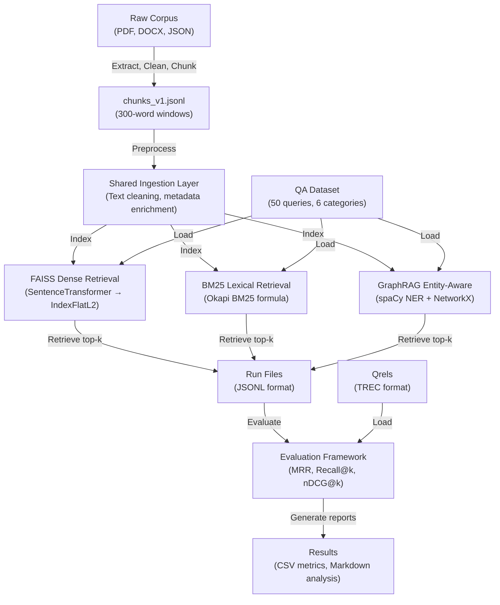

# Figure 1: Overall System Architecture

```mermaid
graph TD
    A["Raw Corpus<br/>(PDF, DOCX, JSON)"] -->|Extract, Clean, Chunk| B["chunks_v1.jsonl<br/>(300-word windows)"]
    B -->|Preprocess| C["Shared Ingestion Layer<br/>(Text cleaning, metadata enrichment)"]
    
    C -->|Index| FAISS["FAISS Dense Retrieval<br/>(SentenceTransformer → IndexFlatL2)"]
    C -->|Index| BM25["BM25 Lexical Retrieval<br/>(Okapi BM25 formula)"]
    C -->|Index| GraphRAG["GraphRAG Entity-Aware<br/>(spaCy NER + NetworkX)"]
    
    D["QA Dataset<br/>(50 queries, 6 categories)"] -->|Load| FAISS
    D -->|Load| BM25
    D -->|Load| GraphRAG
    
    FAISS -->|Retrieve top-k| E["Run Files<br/>(JSONL format)"]
    BM25 -->|Retrieve top-k| E
    GraphRAG -->|Retrieve top-k| E
    
    E -->|Evaluate| F["Evaluation Framework<br/>(MRR, Recall@k, nDCG@k)"]
    
    G["Qrels<br/>(TREC format)"] -->|Load| F
    
    F -->|Generate reports| H["Results<br/>(CSV metrics, Markdown analysis)"]
```

