# Figure 2: FAISS Dense Retrieval Pipeline

```mermaid
graph LR
    A["Document Chunks<br/>(text)"] -->|SentenceTransformer<br/>all-MiniLM-L6-v2| B["Embeddings<br/>(384-dim vectors)"]
    
    B -->|Build Index| C["FAISS IndexFlatL2"]
    
    C -->|Store| D["Index Files<br/>(faiss.index<br/>chunk_ids.json<br/>config.json)"]
    
    D -->|Retrieve| E["Query<br/>(text)"]
    
    E -->|SentenceTransformer| F["Query Embedding<br/>(384-dim vector)"]
    
    F -->|L2 Distance| C
    
    C -->|Top-k nearest<br/>neighbors| G["Retrieved Chunks<br/>(ranked by distance)"]
    
    G -->|Convert distance<br/>to score| H["Scored Results<br/>(score = 1 / 1+distance)"]
    
    subgraph FAISS_Config["⚙️ FAISS Configuration & Details"]
        FC1["Model Architecture"]
        FC1a["├─ Name: all-MiniLM-L6-v2"]
        FC1b["├─ Embedding Dim: 384"]
        FC1c["├─ Pooling: Mean"]
        FC1d["└─ Parameters: 22.7M"]
        
        FC2["Index Settings"]
        FC2a["├─ Type: IndexFlatL2"]
        FC2b["├─ Index Size: ~10MB"]
        FC2c["├─ Metric: L2 Distance"]
        FC2d["└─ Training: None (exact)"]
        
        FC3["Search Behavior"]
        FC3a["├─ Search Algorithm: Brute Force"]
        FC3b["├─ Top-k: Configurable"]
        FC3c["├─ Score Function: 1/(1+distance)"]
        FC3d["└─ Complexity: O(d×n)"]
        
        FC4["Performance Metrics"]
        FC4a["├─ Latency: ~92 ms/query"]
        FC4b["├─ MRR@5: 0.7958"]
        FC4c["├─ Recall@10: 0.8571"]
        FC4d["└─ nDCG@10: 0.7742"]
        
        FC5["Strengths & Limitations"]
        FC5a["✓ Strengths: Semantic matching, Paraphrase handling"]
        FC5b["✓ Best on: Paraphrase (1.0), Synthesis (0.92)"]
        FC5c["✗ Limitations: Slow, Embedding bottleneck"]
        FC5d["✗ Worst on: Multi-hop (0.6067)"]
    end
```

**Key Parameters:**
- Model: all-MiniLM-L6-v2 (384 dimensions)
- Index type: IndexFlatL2 (exact, no approximation)
- Similarity metric: L2 distance
- Query latency: ~92ms

