# Figure 4: GraphRAG Entity-Aware Retrieval Pipeline

```mermaid
graph TD
    A["Document Chunks"] -->|spaCy NER<br/>PERSON, ORG, GPE, MONEY, DATE, LAW| B["Standard Entities"]
    A -->|Regex Patterns<br/>SCHEME_NAME, AMOUNT, BENEFICIARY, ELIGIBILITY, DOCUMENT| C["Domain Entities"]
    
    B -->|Combine| D["All Entities"]
    C -->|Combine| D
    
    D -->|Create Entity Nodes<br/>Link MENTIONED_IN chunks| E["Knowledge Graph<br/>(NetworkX DiGraph)"]
    
    D -->|Co-occurrence<br/>CO_OCCURS_WITH edges| E
    
    E -->|Persist| F["Graph Files<br/>(graph.json<br/>chunk_lookup.json)"]
    
    F -->|Load| G["Query<br/>(text)"]
    
    G -->|spaCy NER + Regex| H["Query Entities<br/>(Seed nodes)"]
    
    H -->|Find matching nodes<br/>in graph| I["Seed Nodes"]
    
    I -->|2-hop traversal<br/>Collect referenced chunks| E
    
    E -->|Score chunks<br/>+1.0 direct hit<br/>+0.5 2-hop| J["Scored Results<br/>(ranked by score)"]
    
    subgraph GraphRAG_Config["⚙️ GraphRAG Configuration & Details"]
        GR1["NER & Entity Extraction"]
        GR1a["├─ Standard (spaCy)"]
        GR1a1["│  ├─ PERSON: Named individuals"]
        GR1a2["│  ├─ ORG: Organizations"]
        GR1a3["│  ├─ GPE: Geo-political entities"]
        GR1a4["│  ├─ MONEY: Monetary amounts"]
        GR1a5["│  ├─ DATE: Temporal expressions"]
        GR1a6["│  └─ LAW: Legal entities"]
        GR1b["└─ Domain (Regex Patterns)"]
        GR1b1["   ├─ SCHEME_NAME: Govt welfare schemes"]
        GR1b2["   ├─ AMOUNT: Financial amounts"]
        GR1b3["   ├─ BENEFICIARY: Target groups"]
        GR1b4["   ├─ ELIGIBILITY: Criteria"]
        GR1b5["   └─ DOCUMENT: Document types"]
        
        GR2["Graph Structure"]
        GR2a["├─ Type: NetworkX DiGraph"]
        GR2b["├─ Node Types: Entity nodes, Chunk nodes"]
        GR2c["├─ Edge Types:"]
        GR2c1["│  ├─ MENTIONED_IN: entity→chunk"]
        GR2c2["│  └─ CO_OCCURS_WITH: entity↔entity"]
        GR2d["├─ Persistence: graph.json (3.4 KB)"]
        GR2e["└─ Lookup Table: chunk_lookup.json"]
        
        GR3["Retrieval Algorithm"]
        GR3a["├─ Step 1: Extract query entities (NER + Regex)"]
        GR3b["├─ Step 2: Find seed nodes in graph"]
        GR3c["├─ Step 3: 2-hop graph traversal"]
        GR3d["├─ Step 4: Collect referenced chunks"]
        GR3e["└─ Step 5: Score chunks (+1.0 direct, +0.5 indirect)"]
        
        GR4["Performance Metrics"]
        GR4a["├─ Latency: ~3.29 ms/query"]
        GR4b["├─ MRR@5: 0.6095"]
        GR4c["├─ Recall@10: 0.6875"]
        GR4d["└─ nDCG@10: 0.5909"]
        
        GR5["Category Performance Analysis"]
        GR5a["✓ Good: Entity-Relation (1.0), Synthesis (0.92)"]
        GR5b["⚠️ Fair: Multi-hop (0.33), Terminology (0.63)"]
        GR5c["✗ Weak: Paraphrase (0.27)"]
        
        GR6["Strengths & Limitations"]
        GR6a["✓ Entity Relationships: Captures linked entities"]
        GR6b["✓ Multi-document Linking: 2-hop traversal"]
        GR6c["✗ Small Corpus: Graphs too sparse (10 chunks)"]
        GR6d["✗ Limited Entities: Fewer co-occurrences"]
        GR6e["✗ Entity Extraction Errors: Propagate to search"]
    end
```

**Graph Structure:**
- **Entity Nodes:** text, type, chunk_ids
- **Chunk Nodes:** text, doc_id
- **Edges:** MENTIONED_IN (entity → chunk), CO_OCCURS_WITH (entity ↔ entity)

**Entity Types (12 total):**
- Standard (6): PERSON, ORG, GPE, MONEY, DATE, LAW (spaCy)
- Domain (5): SCHEME_NAME, AMOUNT, BENEFICIARY, ELIGIBILITY, DOCUMENT (regex patterns)

**Query latency:** ~3.29ms (faster than FAISS, slower than BM25)

