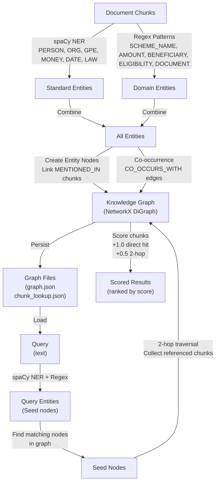

# Figure 4: GraphRAG Entity-Aware Retrieval Pipeline

**Graph Structure:**
- **Entity Nodes:** text, type, chunk_ids
- **Chunk Nodes:** text, doc_id
- **Edges:** MENTIONED_IN (entity → chunk), CO_OCCURS_WITH (entity ↔ entity)

**Entity Types (12 total):**
- Standard: PERSON, ORG, GPE, MONEY, DATE, LAW (spaCy)
- Domain: SCHEME_NAME, AMOUNT, BENEFICIARY, ELIGIBILITY, DOCUMENT (regex)

**Query latency:** ~2-11ms

