# Figure 6: Comprehensive Retriever Comparison

```mermaid
graph TD
    HEADER["🔍 Three Retrieval Paradigms: BM25 vs FAISS vs GraphRAG"]
    
    subgraph BM25_System["🔤 BM25: Lexical Retrieval"]
        BM1["Algorithm"]
        BM1a["├─ Type: Probabilistic model"]
        BM1b["├─ Variant: Okapi BM25"]
        BM1c["├─ Foundation: Term frequency & IDF"]
        BM1d["└─ Cost: Free (open source)"]
        
        BM2["Index Construction"]
        BM2a["├─ Input: Plain text documents"]
        BM2b["├─ Process: Tokenize → Build inverted index"]
        BM2c["├─ Storage: Python pickle (binary)"]
        BM2d["└─ Size: ~2KB for 10 chunks"]
        
        BM3["Query Processing"]
        BM3a["├─ Input: Query text"]
        BM3b["├─ Tokenize: Split & remove stopwords"]
        BM3c["├─ Compute: BM25 score per chunk"]
        BM3d["└─ Return: Ranked by score"]
        
        BM4["Parameters"]
        BM4a["├─ k1 = 1.5 (term saturation)"]
        BM4b["├─ b = 0.75 (length normalization)"]
        BM4c["├─ IDF: Lucene variant"]
        BM4d["└─ Tunable: Yes (adjustable)"]
        
        BM5["Performance"]
        BM5a["├─ Latency: 0.06 ms/query ⭐⭐⭐"]
        BM5b["├─ Memory: Minimal (~2KB index)"]
        BM5c["├─ CPU Usage: Low"]
        BM5d["└─ GPU Required: No"]
        
        BM6["Metrics"]
        BM6a["├─ MRR@5: 0.8304 ⭐ BEST"]
        BM6b["├─ Recall@10: 1.0000 ⭐ PERFECT"]
        BM6c["├─ nDCG@10: 0.8683 ⭐"]
        BM6d["└─ Overall Rank: #1"]
        
        BM7["Strengths"]
        BM7a["✓ Lightning fast"]
        BM7b["✓ Exact term matching"]
        BM7c["✓ Interpretable results"]
        BM7d["✓ No embedding cost"]
        BM7e["✓ Preserves acronyms"]
        
        BM8["Weaknesses"]
        BM8a["✗ No semantic understanding"]
        BM8b["✗ Vocabulary mismatch fails"]
        BM8c["✗ Weak on paraphrase"]
        BM8d["✗ Poor multi-hop reasoning"]
        
        BM9["Best For Categories"]
        BM9a["⭐ Terminology: 1.0000"]
        BM9b["⭐ Exact Lookup: 0.9444"]
        BM9c["• Entity Relation: 0.9444"]
        BM9d["✗ Multi-hop: 0.5500"]
        
        BM10["Use Cases"]
        BM10a["→ Policy documents (terminology-heavy)"]
        BM10b["→ Regulatory compliance (exact match)"]
        BM10c["→ Technical documentation (acronym-rich)"]
        BM10d["→ Low-latency production (mobile/edge)"]
    end
    
    subgraph FAISS_System["🧠 FAISS: Dense Vector Retrieval"]
        FA1["Algorithm"]
        FA1a["├─ Type: Similarity search"]
        FA1b["├─ Embeddings: SentenceTransformer"]
        FA1c["├─ Model: all-MiniLM-L6-v2"]
        FA1d["└─ Metric: L2 distance"]
        
        FA2["Index Construction"]
        FA2a["├─ Input: Plain text documents"]
        FA2b["├─ Process: Tokenize → Embed → Index"]
        FA2c["├─ Storage: Binary FAISS index"]
        FA2d["└─ Size: ~10MB for 10 chunks"]
        
        FA3["Query Processing"]
        FA3a["├─ Input: Query text"]
        FA3b["├─ Embed: SentenceTransformer"]
        FA3c["├─ Distance: Compute L2 distance"]
        FA3d["└─ Return: Top-k by distance"]
        
        FA4["Parameters"]
        FA4a["├─ Embedding Dim: 384"]
        FA4b["├─ Model: all-MiniLM-L6-v2 (22.7M)"]
        FA4c["├─ Index Type: IndexFlatL2"]
        FA4d["└─ Pooling: Mean pooling"]
        
        FA5["Performance"]
        FA5a["├─ Latency: 92.06 ms/query ⚠️"]
        FA5b["├─ Memory: ~10MB index"]
        FA5c["├─ CPU Usage: High (embedding)"]
        FA5d["└─ GPU Recommended: Yes (faster)"]
        
        FA6["Metrics"]
        FA6a["├─ MRR@5: 0.7958"]
        FA6b["├─ Recall@10: 0.8571"]
        FA6c["├─ nDCG@10: 0.7742"]
        FA6d["└─ Overall Rank: #2"]
        
        FA7["Strengths"]
        FA7a["✓ Semantic understanding"]
        FA7b["✓ Paraphrase handling"]
        FA7c["✓ Entity relationship capture"]
        FA7d["✓ Supports multi-hop"]
        FA7e["✓ Language agnostic"]
        
        FA8["Weaknesses"]
        FA8a["✗ Slow (~1500× slower than BM25)"]
        FA8b["✗ Embedding model required"]
        FA8c["✗ Resource intensive"]
        FA8d["✗ Less interpretable"]
        
        FA9["Best For Categories"]
        FA9a["⭐ Paraphrase: 1.0000"]
        FA9b["⭐ Entity Relation: 1.0000"]
        FA9c["⭐ Terminology: 1.0000"]
        FA9d["⭐ Synthesis: 0.9167"]
        
        FA10["Use Cases"]
        FA10a["→ Semantic search (meaning-based)"]
        FA10b["→ Paraphrased queries (synonyms)"]
        FA10c["→ Customer support (FAQ matching)"]
        FA10d["→ Research discovery (cross-domain)"]
    end
    
    subgraph GraphRAG_System["🕸️ GraphRAG: Entity-Aware Retrieval"]
        GR1["Algorithm"]
        GR1a["├─ Type: Graph-based reasoning"]
        GR1b["├─ Graph: Knowledge graph"]
        GR1c["├─ NER: spaCy + domain regex"]
        GR1d["└─ Traversal: 2-hop neighborhood"]
        
        GR2["Index Construction"]
        GR2a["├─ Input: Plain text documents"]
        GR2b["├─ Process: NER → Entity extraction → Graph build"]
        GR2c["├─ Storage: JSON graph representation"]
        GR2d["└─ Size: ~3.4KB for 10 chunks"]
        
        GR3["Query Processing"]
        GR3a["├─ Input: Query text"]
        GR3b["├─ Extract: Query entities (NER + regex)"]
        GR3c["├─ Find: Seed nodes in graph"]
        GR3d["├─ Traverse: 2-hop neighborhoods"]
        GR3e["└─ Return: Scored chunks"]
        
        GR4["Parameters"]
        GR4a["├─ NER Tool: spaCy (6 standard types)"]
        GR4b["├─ Domain Regex: 5 custom patterns"]
        GR4c["├─ Traversal: 2-hop maximum"]
        GR4d["└─ Scoring: +1.0 direct, +0.5 indirect"]
        
        GR5["Performance"]
        GR5a["├─ Latency: 3.29 ms/query"]
        GR5b["├─ Memory: ~3.4KB index + graph"]
        GR5c["├─ CPU Usage: Low (no embedding)"]
        GR5d["└─ GPU Required: No"]
        
        GR6["Metrics"]
        GR6a["├─ MRR@5: 0.6095"]
        GR6b["├─ Recall@10: 0.6875"]
        GR6c["├─ nDCG@10: 0.5909"]
        GR6d["└─ Overall Rank: #3"]
        
        GR7["Strengths"]
        GR7a["✓ Fast (3.29ms, faster than FAISS)"]
        GR7b["✓ Entity relationships explicit"]
        GR7c["✓ Multi-document linking"]
        GR7d["✓ Low resource cost"]
        GR7e["✓ Interpretable graph structure"]
        
        GR8["Weaknesses"]
        GR8a["✗ Underperforms all methods"]
        GR8b["✗ Needs tuning on small corpus"]
        GR8c["✗ NER extraction quality critical"]
        GR8d["✗ Sparse graphs (few entities)"]
        
        GR9["Best For Categories"]
        GR9a["⭐ Entity Relation: 1.0000"]
        GR9b["• Synthesis: 0.9167"]
        GR9c["• Terminology: 0.6250"]
        GR9d["✗ Paraphrase: 0.2667 (worst)"]
        
        GR10["Use Cases"]
        GR10a["→ Large knowledge graphs"]
        GR10b["→ Entity-centric queries"]
        GR10c["→ Multi-hop reasoning"]
        GR10d["→ Medium-sized corpus (100+ docs)"]
    end
    
    subgraph Comparison_Matrix["📊 Quick Comparison Matrix"]
        CM1["Dimension: Speed"]
        CM1a["Winner: BM25 (0.06ms) - 1500× faster"]
        
        CM2["Dimension: Accuracy (MRR@5)"]
        CM2a["Winner: BM25 (0.8304)"]
        
        CM3["Dimension: Semantic Quality"]
        CM3a["Winner: FAISS (handles paraphrase, entities)"]
        
        CM4["Dimension: Interpretability"]
        CM4a["Winner: BM25 (see exact matching terms)"]
        
        CM5["Dimension: Resource Efficiency"]
        CM5a["Winner: BM25 (no GPU, no embedding model)"]
        
        CM6["Dimension: Multi-hop Reasoning"]
        CM6a["Tied: All struggle (max 0.61 MRR)"]
        
        CM7["Dimension: Entity Relationships"]
        CM7a["Winner: FAISS (0.6067 to 1.0000 range)"]
        
        CM8["Dimension: Scalability Potential"]
        CM8a["Winner: FAISS (scales to large corpus)"]
    end
    
    HEADER --> BM25_System
    HEADER --> FAISS_System
    HEADER --> GraphRAG_System
    HEADER --> Comparison_Matrix
```

---

## Summary Table: Key Characteristics

| Dimension | BM25 | FAISS | GraphRAG |
|-----------|------|-------|----------|
| **Algorithm** | Probabilistic (TF-IDF) | Vector similarity | Graph traversal |
| **Speed** | ⭐⭐⭐ 0.06ms | ⚠️ 92ms | ✓ 3.29ms |
| **MRR@5** | **0.8304** | 0.7958 | 0.6095 |
| **Recall@10** | **1.0000** | 0.8571 | 0.6875 |
| **Setup Cost** | Minimal | High (embedding model) | Medium |
| **GPU Required** | No | Recommended | No |
| **Interpretability** | High (see matches) | Low (black box) | Medium (graph visible) |
| **Best On** | Terminology, Exact | Paraphrase, Semantic | Entity Relations |
| **Worst On** | Paraphrase (N/A) | Multi-hop (0.61) | Paraphrase (0.27) |
| **Production Grade** | ✅ Yes | ✅ Yes (with GPU) | ⚠️ Needs tuning |

---

## Strategic Recommendations

**For Policy/Regulatory Documents:** Use **BM25**
- Fast, exact terminology matching
- Results are interpretable
- Lowest infrastructure cost

**For Customer/Semantic Search:** Use **FAISS**
- Handles paraphrases and synonyms
- Captures implicit relationships
- Worth the latency trade-off

**For Entity-Centric Applications:** Use **Hybrid (BM25 + FAISS)**
- Combine strengths of both
- Re-rank BM25 results with FAISS scores
- Get speed + semantics

**Current Dataset (10 chunks, 28 queries):** BM25 is optimal

**Scaled Dataset (100+ chunks, 100+ queries):** FAISS becomes more attractive
