# Figure 7: Complete System Architecture with Detailed Parameters

```mermaid
graph TD
    INPUT["📥 Input Layer"] -->|Raw Data| CORPUS["Corpus: 10 chunks<br/>(~20KB from 5 docs)"]
    CORPUS -->|qa_dataset_v1.jsonl| QUERIES["Queries: 28 QA pairs<br/>(6 categories)"]
    
    CORPUS -->|Preprocessing| PREP["🔧 Text Processing Pipeline"]
    
    subgraph Preprocessing["🔧 Shared Preprocessing (All Retrievers)"]
        P1["Step 1: Extract Text"]
        P1a["├─ Remove HTML/XML tags"]
        P1b["├─ Extract plain text"]
        P1c["└─ Preserve structure"]
        
        P2["Step 2: Clean Text"]
        P2a["├─ Remove extra whitespace"]
        P2b["├─ Normalize unicode"]
        P2c["└─ Fix encoding issues"]
        
        P3["Step 3: Chunk"]
        P3a["├─ Window size: 300 words"]
        P3b["├─ Overlap: None"]
        P3c["└─ Result: chunks_v1.jsonl"]
        
        P4["Step 4: Enrich Metadata"]
        P4a["├─ chunk_id: Auto-generated"]
        P4b["├─ doc_id: Source document"]
        P4c["├─ word_count: 300±50"]
        P4d["└─ domain_tags: (indian_govt_schemes)"]
    end
    
    PREP -->|Split into 3 paths| BM25_PATH["⬇️ Path 1: BM25"]
    PREP -->|Split into 3 paths| FAISS_PATH["⬇️ Path 2: FAISS"]
    PREP -->|Split into 3 paths| GRAPHRAG_PATH["⬇️ Path 3: GraphRAG"]
    
    subgraph BM25_Index["🔤 BM25 Indexing Pipeline"]
        BM_1["Input: 10 chunks"]
        BM_2["Process: Tokenize"]
        BM_2a["├─ Lowercase: All text"]
        BM_2b["├─ Remove: Punctuation"]
        BM_2c["├─ Split: Whitespace"]
        BM_2d["└─ Keep: Acronyms (PM-KISAN)"]
        
        BM_3["Build Index"]
        BM_3a["├─ Structure: Inverted Index (term → chunks)"]
        BM_3b["├─ Library: rank-bm25"]
        BM_3c["├─ Formula: Okapi BM25"]
        BM_3d["└─ Store: bm25_index.pkl (1.6KB)"]
        
        BM_4["Configuration"]
        BM_4a["├─ k1: 1.5 (term saturation)"]
        BM_4b["├─ b: 0.75 (length norm)"]
        BM_4c["├─ Total docs: 10"]
        BM_4d["└─ Avg doc length: 300 words"]
        
        BM_1 --> BM_2 --> BM_3 --> BM_4
    end
    
    subgraph FAISS_Index["🧠 FAISS Indexing Pipeline"]
        FA_1["Input: 10 chunks"]
        FA_2["Embed: SentenceTransformer"]
        FA_2a["├─ Model: all-MiniLM-L6-v2"]
        FA_2b["├─ Dimensions: 384"]
        FA_2c["├─ Batch size: 32"]
        FA_2d["└─ Time: ~2 seconds"]
        
        FA_3["Embeddings Output"]
        FA_3a["├─ 10 vectors × 384 dim"]
        FA_3b["├─ Format: float32"]
        FA_3c["└─ Size: ~15KB (uncompressed)"]
        
        FA_4["Build Index"]
        FA_4a["├─ Type: IndexFlatL2"]
        FA_4b["├─ Metric: L2 distance"]
        FA_4c["├─ Library: faiss-cpu"]
        FA_4d["└─ Store: faiss.index (~10MB)"]
        
        FA_5["Metadata Files"]
        FA_5a["├─ chunk_ids.json: ID mapping"]
        FA_5b["├─ config.json: Settings"]
        FA_5c["└─ index version: 1.0"]
        
        FA_1 --> FA_2 --> FA_3 --> FA_4 --> FA_5
    end
    
    subgraph GraphRAG_Index["🕸️ GraphRAG Indexing Pipeline"]
        GR_1["Input: 10 chunks"]
        GR_2["Extract Entities"]
        GR_2a["├─ Standard NER (spaCy)"]
        GR_2a1["│  ├─ PERSON, ORG, GPE"]
        GR_2a2["│  ├─ MONEY, DATE, LAW"]
        GR_2a3["│  └─ Result: ~20 entities"]
        GR_2b["├─ Domain Regex (custom)"]
        GR_2b1["│  ├─ SCHEME_NAME, AMOUNT"]
        GR_2b2["│  ├─ BENEFICIARY, ELIGIBILITY"]
        GR_2b3["│  ├─ DOCUMENT"]
        GR_2b4["│  └─ Result: ~15 entities"]
        
        GR_3["Build Knowledge Graph"]
        GR_3a["├─ Nodes: Entities + Chunks"]
        GR_3b["├─ Edges:"]
        GR_3b1["│  ├─ MENTIONED_IN (entity→chunk)"]
        GR_3b2["│  └─ CO_OCCURS_WITH (entity↔entity)"]
        GR_3c["├─ Library: NetworkX"]
        GR_3d["└─ Type: DiGraph"]
        
        GR_4["Persist Graph"]
        GR_4a["├─ graph.json: Full graph"]
        GR_4b["├─ chunk_lookup.json: Mapping"]
        GR_4c["└─ Size: ~3.4KB (JSON)"]
        
        GR_1 --> GR_2 --> GR_3 --> GR_4
    end
    
    BM25_INDEX["Index Files"] -->|Load| BM25_QUERY
    FAISS_INDEX["Index Files"] -->|Load| FAISS_QUERY
    GRAPHRAG_INDEX["Index Files"] -->|Load| GRAPHRAG_QUERY
    
    QUERIES -->|Feed| BM25_QUERY["🔤 BM25 Query Execution"]
    QUERIES -->|Feed| FAISS_QUERY["🧠 FAISS Query Execution"]
    QUERIES -->|Feed| GRAPHRAG_QUERY["🕸️ GraphRAG Query Execution"]
    
    subgraph BM25_Query["🔤 BM25 Query Execution"]
        BQ_1["Input: Query text (28 queries)"]
        BQ_2["Tokenize Query"]
        BQ_2a["├─ Same as indexing"]
        BQ_2b["├─ Lowercase, remove punctuation"]
        BQ_2c["└─ Result: Query tokens"]
        
        BQ_3["Compute Scores"]
        BQ_3a["├─ For each chunk:"]
        BQ_3a1["│  ├─ Calculate BM25(query, chunk)"]
        BQ_3a2["│  ├─ Apply k1 & b parameters"]
        BQ_3a3["│  └─ Normalize by doc length"]
        BQ_3b["└─ Time: 0.06ms per query"]
        
        BQ_4["Rank & Return"]
        BQ_4a["├─ Sort by score (descending)"]
        BQ_4b["├─ Top-k: 10 results"]
        BQ_4c["├─ Format: {chunk_id, score, rank}"]
        BQ_4d["└─ Output: 28 × 10 = 280 results"]
        
        BQ_1 --> BQ_2 --> BQ_3 --> BQ_4
    end
    
    subgraph FAISS_Query["🧠 FAISS Query Execution"]
        FQ_1["Input: Query text (28 queries)"]
        FQ_2["Embed Query"]
        FQ_2a["├─ Same model as indexing"]
        FQ_2b["├─ all-MiniLM-L6-v2"]
        FQ_2c["└─ Result: 384-dim vector"]
        
        FQ_3["Distance Calculation"]
        FQ_3a["├─ For each chunk embedding:"]
        FQ_3a1["│  ├─ Compute L2 distance"]
        FQ_3a2["│  ├─ Formula: √(Σ(q_i - d_i)²)"]
        FQ_3a3["│  └─ Invert to score"]
        FQ_3b["└─ Time: 92ms per query"]
        
        FQ_4["Rank & Return"]
        FQ_4a["├─ Sort by distance (ascending)"]
        FQ_4b["├─ Top-k: 5 results (default)"]
        FQ_4c["├─ Score: 1/(1+distance)"]
        FQ_4d["└─ Output: 28 × 5 = 140 results"]
        
        FQ_1 --> FQ_2 --> FQ_3 --> FQ_4
    end
    
    subgraph GRAPHRAG_Query["🕸️ GraphRAG Query Execution"]
        GQ_1["Input: Query text (28 queries)"]
        GQ_2["Extract Query Entities"]
        GQ_2a["├─ Apply spaCy NER"]
        GQ_2b["├─ Apply domain regex"]
        GQ_2c["└─ Result: Seed entities"]
        
        GQ_3["Find Seed Nodes"]
        GQ_3a["├─ Lookup entities in graph"]
        GQ_3b["├─ Match by name/type"]
        GQ_3c["└─ Direct hits: +1.0 score"]
        
        GQ_4["Traverse Graph"]
        GQ_4a["├─ 2-hop traversal"]
        GQ_4b["├─ Follow MENTIONED_IN edges"]
        GQ_4c["├─ Follow CO_OCCURS_WITH edges"]
        GQ_4d["└─ Collect referenced chunks"]
        
        GQ_5["Score Chunks"]
        GQ_5a["├─ Direct hit: +1.0"]
        GQ_5b["├─ 2-hop neighbor: +0.5"]
        GQ_5c["├─ Score aggregation: sum"]
        GQ_5d["└─ Time: 3.29ms per query"]
        
        GQ_6["Rank & Return"]
        GQ_6a["├─ Sort by score (descending)"]
        GQ_6b["├─ Top-k: 4.67 avg results"]
        GQ_6c["├─ Output format: {chunk_id, score}"]
        GQ_6d["└─ Output: 28 × 4.67 ≈ 131 results"]
        
        GQ_1 --> GQ_2 --> GQ_3 --> GQ_4 --> GQ_5 --> GQ_6
    end
    
    BQ_4 -->|Run files| RUNS["📁 Run Files (JSONL)"]
    FQ_4 -->|Run files| RUNS
    GQ_6 -->|Run files| RUNS
    
    RUNS -->|Load| EVAL["📊 Evaluation Layer"]
    
    subgraph Evaluation["📊 Evaluation Pipeline"]
        EV_1["Load Qrels (Ground Truth)"]
        EV_1a["├─ File: qrels.tsv (TREC format)"]
        EV_1b["├─ Format: query_id, chunk_id, relevance"]
        EV_1c["└─ Total: 28 queries × 2-3 relevant chunks"]
        
        EV_2["Compute Metrics (Per Query)"]
        EV_2a["├─ For each query:"]
        EV_2a1["│  ├─ MRR: rank of first relevant"]
        EV_2a2["│  ├─ Recall@k: coverage"]
        EV_2a3["│  ├─ nDCG@k: ranking quality"]
        EV_2a4["│  └─ Latency: query time"]
        
        EV_3["Aggregate Metrics"]
        EV_3a["├─ Average across 28 queries"]
        EV_3b["├─ Compute std deviation"]
        EV_3c["└─ Result: comparison_summary.csv"]
        
        EV_4["Per-Category Analysis"]
        EV_4a["├─ Group by category (6 types)"]
        EV_4b["├─ Compute MRR per category"]
        EV_4c["└─ Result: per_category.csv"]
        
        EV_5["Generate Reports"]
        EV_5a["├─ Markdown report"]
        EV_5b["├─ Key findings + analysis"]
        EV_5c["└─ Failure mode discussion"]
        
        EV_1 --> EV_2 --> EV_3 --> EV_4 --> EV_5
    end
    
    EVAL -->|Output| RESULTS["📈 Results & Analysis"]
    
    subgraph Results_Output["📈 Results Output"]
        RES_1["comparison_summary.csv"]
        RES_1a["├─ Retriever, MRR@5, MRR@10, Recall, nDCG, Latency"]
        RES_1b["├─ Rows: 3 (BM25, FAISS, GraphRAG)"]
        RES_1c["└─ Key: BM25 wins (MRR@5=0.8304)"]
        
        RES_2["per_category.csv"]
        RES_2a["├─ Category × Retriever matrix"]
        RES_2b["├─ Rows: 6 categories"]
        RES_2c["└─ Shows per-retriever specialty"]
        
        RES_3["comparison_report.md"]
        RES_3a["├─ Formatted tables"]
        RES_3b["├─ Key findings analysis"]
        RES_3c["└─ Failure mode discussion"]
        
        RES_4["sample_queries.md"]
        RES_4a["├─ 5 example queries"]
        RES_4b["├─ Side-by-side results"]
        RES_4c["└─ Qualitative examples"]
    end
    
    BM25_PATH --> BM25_INDEX
    FAISS_PATH --> FAISS_INDEX
    GRAPHRAG_PATH --> GRAPHRAG_INDEX
    
    BM25_INDEX --> BM25_QUERY
    FAISS_INDEX --> FAISS_QUERY
    GRAPHRAG_INDEX --> GRAPHRAG_QUERY

```



---

## Index Files Generated

### BM25 Index
- **File:** `indexes/bm25/bm25_index.pkl`
- **Size:** 1.6 KB
- **Format:** Python pickle (binary serialization)
- **Contents:** BM25Okapi object + metadata

### FAISS Index
- **Files:**
  - `indexes/faiss/faiss.index`: Dense index
  - `indexes/faiss/chunk_ids.json`: ID mapping
  - `indexes/faiss/config.json`: Configuration
- **Total Size:** ~10 MB
- **Format:** FAISS binary format + JSON

### GraphRAG Index
- **Files:**
  - `indexes/graphrag/graph.json`: Full knowledge graph
  - `indexes/graphrag/chunk_lookup.json`: Entity-to-chunk mapping
- **Total Size:** ~3.4 KB
- **Format:** JSON

---

## Query Processing Performance

| Retriever | Avg Latency | Per Query | Total (28q) | Bottleneck |
|-----------|-------------|-----------|------------|-----------|
| BM25 | 0.06 ms | Fast | 1.7 ms | None (CPU) |
| FAISS | 92 ms | Embed | 2.6 sec | Embedding model |
| GraphRAG | 3.29 ms | Graph traversal | 92 ms | Entity extraction |

---

## Data Flow Summary

```
Raw Corpus (PDF/DOCX/JSON)
    ↓
Text Extraction & Cleaning
    ↓
Chunking (300-word windows)
    ├─→ BM25 Path: Tokenize → Inverted Index
    ├─→ FAISS Path: Embed → Dense Index
    └─→ GraphRAG Path: NER → Knowledge Graph
    
Query Input (28 QA pairs)
    ├─→ BM25: Tokenize → Score → Rank
    ├─→ FAISS: Embed → L2 Distance → Rank
    └─→ GraphRAG: Entity Extract → Graph Lookup → 2-hop Traverse → Score
    
Results Aggregation
    ├─→ Compute Metrics (MRR, Recall, nDCG)
    ├─→ Per-category Breakdown
    └─→ Generate Reports

Output: comparison_summary.csv + per_category.csv + comparison_report.md
```
